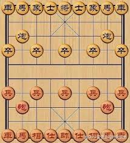

# 中国象棋设计模块与实现思路
### 顶模块 CHESS
- **Selector**：接受键盘的输出，产生输出给各游戏状态
- **状态寄存器**：MENU、GAME、SETTLE
- **键盘模块**：接受键盘的输入，产生对应输出给 Selector
- **音效模块**：根据各模块的输出播放不同音效
- **渲染模块**：根据当前状态选择不同渲染策略

### 选择器 Selector
根据键盘的输入改变其位置和按下信息

- 光标coe信息
- 位置坐标x, y
- 是否按下(1 bit)
- 选中棋子的数据(12 bits)

其数据传输给各模块，各个状态根据收到的数据产生对应效果

### 菜单 MENU
- **输入**：Selector 的数据
- **输出**：状态量

### 游戏 GAME
- **输入**：Selector 的数据
- **输出**：状态量

### 结算 SETTLE
- **输入**：Selector 的数据
- **输出**：状态量

### 键盘 KEYBOARD
- **输入**：键盘
- **输出**：对应键的 ASCII 码

### 音效 SOUND
- **输入**：音效码（攻击 `0`、移动 `1`、将军 `2`、将杀 `3`、选中按钮 `4`）
- **输出**：音效

### 渲染 GFX
- **输入**：当前渲染策略（`0` MENU、`1` GAME、`2` END）、游戏状态寄存器的数据、Selector、各种图片数据

## 棋盘

## 音乐模块 (Music)

使用 PWM 控制蜂鸣器发出音效/音乐。

## 键盘控制 (Keyboard)

使用相关端口和协议，需要五个按键：
*   `W`, `A`, `S`, `D`: 控制上下左右
*   `G`: 控制选中/取消选择

## 游戏逻辑

### 全局棋盘状态

在整盘棋局中，我们需要在全局保存以下游戏状态：

| 状态分类 | 包含逻辑/子状态 |
| :--- | :--- |
| **菜单状态** | 开始游戏 |
| **游戏状态** | 悔棋、汉回合、楚回合 |
| **结算状态** | 胜者判定、重新开始 |

同时还需要一个 **Selector 寄存器**，用于存储光标位置。

### 棋子状态

每个棋子由 **10 bits** 组成，定义如下：

| 属性 | 位宽 | 描述 | 编码示例 |
| :--- | :---: | :--- | :--- |
| **阵营** | 1 bit | `0`: 汉 (红) `1`: 楚 (黑) | `0` |
| **种类** | 3 bits | `001`: 将/帅 `010`: 士/仕 `011`: 象/相 `100`: 马 `101`: 车 `110`: 炮 `111`: 卒/兵 | `111` |
| **位置** | 8 bits | 行 (Row): 4 bits 列 (Col): 4 bits | `0000 0000` |

> 综上，只需要 12 bits 就可以完整的表示一个棋子。
> 如 `0 111 000 000` 表示一枚红色的兵在 0 行 0 列。

### 棋子行为

所有棋子的行为可以分为以下两种：
1.  **移动**
2.  **攻击**

我们在全局设置一个 **选择器 (Selector)**，其中保存了当前选择的棋子。系统将判断该棋子可选择的落点，并根据目标点的棋子种类（敌方/我方）来执行不同的行为。

### 选择器光标

玩家通过键盘操作选择器光标上下左右移动，并有一个选择按钮用于选中棋子、移动到指定位置、选择选项。

方便起见，使用基于像素的判断逻辑：

| 对象 | 判定逻辑 |
| :--- | :--- |
| **按钮** | 设置 $x, y$ 阈值，只要选择器坐标位于这个 Box 区域内即视为选中。 |
| **棋子** | 假设每个方格宽度为 `WIDTH`，只需整除 `WIDTH` 即可得到对应棋盘位置，进而选中对应棋子或位置。 |

### 将杀判断

将杀判断流程如下：

1.  **找到双方“将/帅”的位置**
    *   在棋盘数据结构中遍历，记录红方“帅”和黑方“将”的坐标。

2.  **判断是否被直接攻击**
    *   检查对方所有棋子的可攻击范围，判断“将/帅”是否在其中。如果在，则“被将军”。

3.  **判断“将/帅”是否能移动**
    *   检查“将/帅”能否移动到安全位置（不被攻击的格子）。

4.  **判断己方是否有解救办法**
    *   检查己方所有棋子是否能通过移动、吃子、挡住攻击路径等方式解除“被将军”状态。

5.  **判定胜负**
    *   如果“将/帅”被攻击且无法解救，则判定为“被将杀”，游戏结束。

### 交互提示

吃子、移动、选中按钮、将军、非法操作等时候播放指定的音效。

> 然而这带来一个问题，如果要同时实现背景音乐和音效，需要实现混音功能，这个复杂度较高。我们认为音效的优先级更高，所以暂时搁置音乐，之后再考虑实现混音。

## 渲染逻辑

考虑到棋盘作为背景图片，其上会叠加各种棋子和光标，需要考虑渲染冲突的问题。先前的经验是设置一个缓冲区，在帧缓冲中先把整个帧渲染完成，然后再输出到显示器中。